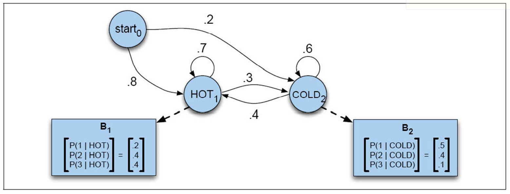

# HMM Decoding

HMM Decoding: Viterbi Algorithm: 

Programmatically implement the Viterbi algorithm and run it with the HMM in Figure to compute the most likely weather sequences for each of the two observation sequences, 331122313 and 331123312.

https://en.wikipedia.org/wiki/Viterbi_algorithm

