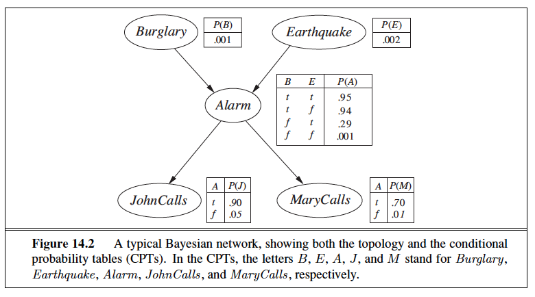

# HMM Decoding

HMM Decoding: Viterbi Algorithm: 
Programmatically implement the Viterbi algorithm and run it with the HMM in Figure to compute the most likely weather sequences for each of the two observation sequences, 331122313 and 331123312.

